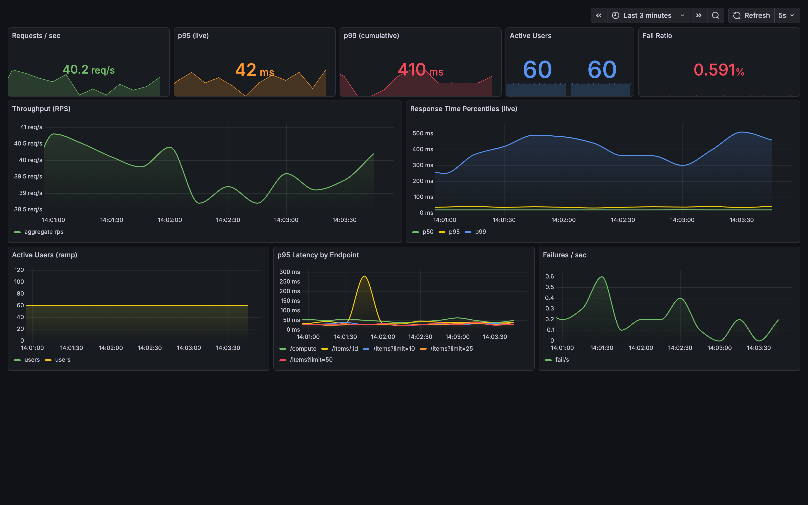
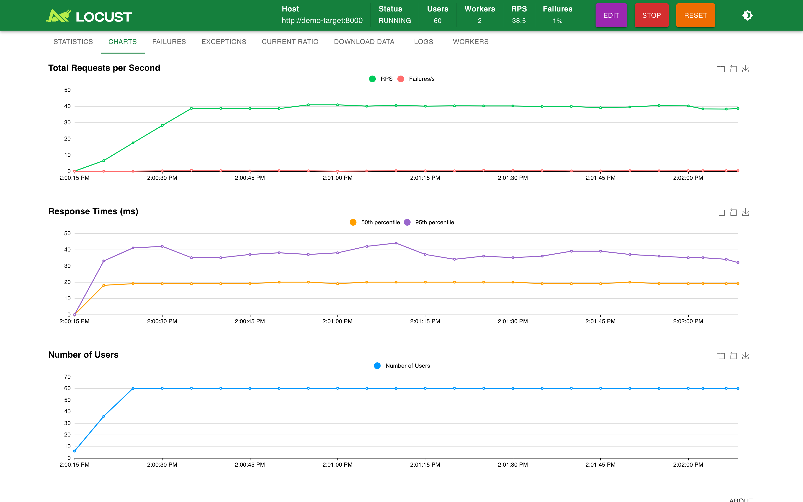
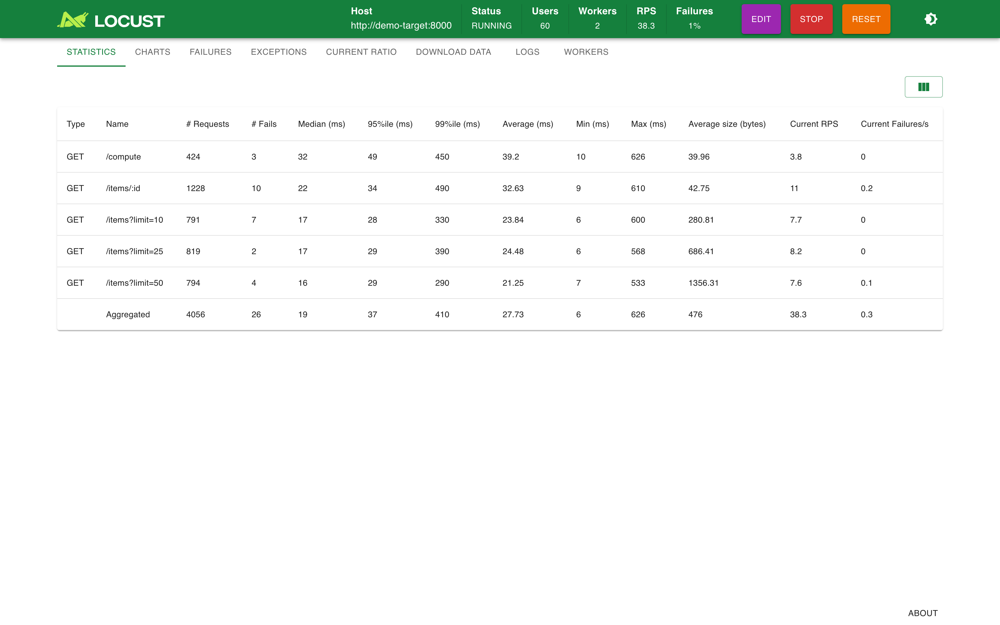

# Production-Grade Distributed Load Testing Platform

## Design Goals

- Eliminate false confidence in load tests
- Enable deterministic performance runs
- Separate workload modeling from transport
- Support horizontal generator scaling
- Remain portable across container runtimes

## Screenshots

A `baseline` run (60 users) against the bundled demo target. Note the visible
tail: median ≈ 19ms and p95 ≈ 40ms, while p99 ≈ 410ms from the 2% injected
tail — exactly the percentile spread that averages would hide.

### Grafana — load test overview

Real p95/p99 sourced from Locust's own stats engine (see
[Observability](#observability)), plus per-endpoint latency.



### Locust — live charts



### Locust — request statistics



## Failure Modes in Load Testing

Some failures make tests unrealistic.
Others make them dangerously misleading.

The worst load tests are not the naive ones, 
they are the ones that produce false confidence.

### Tests that silently invalidate results

- Coordinated omission
  - Latency pauses hide inside the load generator, dramatically understating tail latency.
- Load generator bottlenecks
  - The test saturates the generator before the system, producing false capacity signals.
- Percentile blindness (averages hide pain)
  - Averages look healthy while P95/P99 users experience unacceptable latency.
- Missing saturation signals
  - Without CPU, memory, queue depth, and connection pressure, you cannot identify the real bottleneck.

### Tests that model the wrong reality

- Testing only happy-path endpoints
- Unrealistic ramp patterns

## Prerequisites

A container runtime with Compose support is required.

Tested with:
- Docker Compose V2 (primary)
- Podman + podman-compose (compatible)

The stack is runtime-agnostic and intentionally avoids engine-specific features.

## Quickstart

Run the stack (master + workers):

```bash
docker compose up --build --scale locust-worker=2
```

Podman users can replace docker compose with podman-compose.

### Access the UIs

- Locust: http://localhost:8089
- Grafana: http://localhost:3000
- Prometheus: http://localhost:9090

### Validate the Stack

1. Access the Locust UI.
2. Target host should default to http://demo-target:8000 (included demo API) or set BASE_URL to your API.
3. Start a small run (example):
   - Users: 50
   - Spawn rate: 5
   - Duration: 1m

Confirm that workers register with the master before initiating larger runs.

### Artifacts

Artifacts are intended to support regression detection and capacity comparison across runs.
- CSV and run metadata are written to ./artifacts/ (mounted volume).

### Notes

- This mode is the fastest feedback loop for iteration and CI smoke runs.
- Distributed mode is enabled even locally (master/worker).

---

## Observability

The platform's thesis is that **percentile blindness** invalidates load tests,
so real tail latency must be first-class — not approximated.

### Real percentiles, straight from Locust

The Locust master exposes a Prometheus endpoint at `:8089/metrics`
(registered in `locustfile.py`, no extra dependencies). Percentiles come from
Locust's own stats engine via `get_current_response_time_percentile`, so
`locust_response_time_current_ms{quantile="0.95"}` is the *real* p95 — not the
always-zero value the external `locust_exporter` reports for percentiles.

Key metrics:

| Metric | Meaning |
|---|---|
| `locust_response_time_current_ms{quantile}` | Sliding-window p50/p95/p99 (live) |
| `locust_response_time_total_ms{quantile}` | Cumulative p50/p95/p99 over the run |
| `locust_rps`, `locust_fail_ratio`, `locust_users` | Aggregate throughput / errors / load |
| `locust_endpoint_p95_ms{name,method}` | Per-endpoint p95 |

### Scrape topology

Prometheus scrapes two jobs (`prometheus/prometheus.yml`):

- `locust-native` → `locust-master:8089/metrics` — real percentiles (preferred)
- `locust` → `locust-exporter:9646` — worker counts and request totals

### Bounded cardinality

`get_item` groups its 1000 random ids under the request name `/items/:id`, so
Prometheus series stay bounded instead of exploding to ~1000 per-id entries.

### Grafana

The **Load Test Overview** dashboard is provisioned from
`grafana/provisioning/dashboards/` and loads automatically — no manual import.

---

## Profiles

Profiles provide deterministic, repeatable headless runs suitable for CI and capacity validation.

Run them by setting env vars inline (examples below), or by sourcing the provided `.env.*` files.

Smoke:
```bash
TEST_PROFILE=smoke LOCUST_USERS=10 LOCUST_SPAWN_RATE=2 LOCUST_DURATION=30s docker compose --profile runner up --build locust-runner
```

Baseline:
```bash
TEST_PROFILE=baseline LOCUST_USERS=50 LOCUST_SPAWN_RATE=5 LOCUST_DURATION=5m docker compose --profile runner up --build locust-runner
```

Spike:
```bash
TEST_PROFILE=spike LOCUST_USERS=200 LOCUST_SPAWN_RATE=50 LOCUST_DURATION=60s docker compose --profile runner up --build locust-runner
```

Using the checked-in env files:

```bash
set -a && source .env.smoke && set +a
docker compose --profile runner up --build locust-runner
```

Artifacts will appear in ./artifacts/ as CSV.

---

## Scaling the Load Generator

To increase load generator capacity on your machine:
```bash
docker compose up --build --scale locust-worker=8
```

### What scales

- locust-worker containers scale horizontally
- The Locust master coordinates workers automatically

### How to tell if the load generator is the bottleneck

- Grafana dashboard: worker CPU pegged, RPS stops increasing, latency behavior looks "flat weird"
- Locust UI: increasing users does not increase throughput proportionally

### Recommended practice

- Begin below expected capacity and ramp gradually.
- Watch p95/p99 latency and error rate as you increase load.
- If the load generator saturates first, add workers (or move to Kubernetes later).

---

## Interpreting Results

Focus on signals, not single metrics.

### Warning signs

- Rising p95/p99 latency while throughput plateaus
- Error rate increasing with load
- CPU saturation without proportional RPS gain
- Queue depth or connection pressure climbing

### Healthy scaling typically shows

- Throughput increasing proportionally with users
- Stable tail latency
- Controlled error rates

Always validate that the load generator is not the bottleneck before drawing conclusions.

---

## Protocol adapters (HTTP today, gRPC later)

Scenarios are written against a small client interface:
- HTTP adapter: src/platform/clients/http.py (implemented)
- gRPC adapter: src/platform/clients/grpc.py (stub, planned)

To add gRPC later, implement the same interface and switch via CLIENT=grpc (no scenario rewrite).
